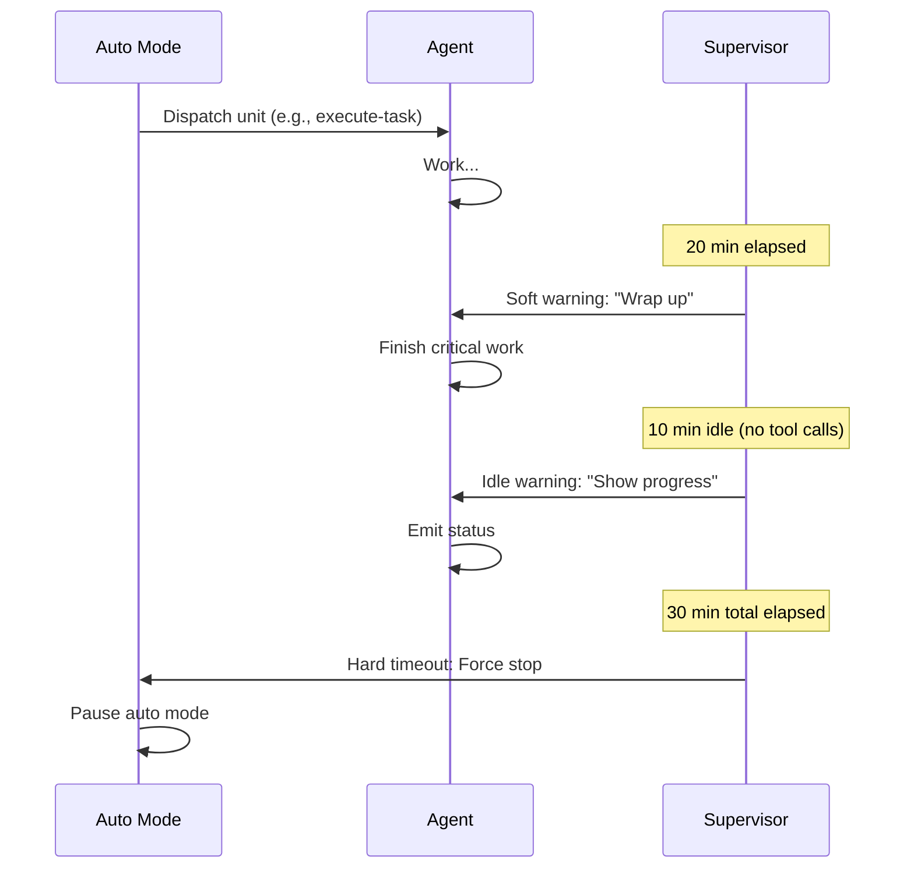

GSD auto mode includes built-in supervision to prevent runaway costs and stuck execution. This page covers timeout configuration and budget ceilings.

## Auto Supervisor

The auto supervisor monitors agent progress during `/gsd auto` and enforces three types of timeouts:

<CardGroup cols={3}>
  <Card title="Soft Timeout" icon="bell">
    **Default: 20 minutes**
    
    Warns the agent to wrap up and produce durable output.
  </Card>
  <Card title="Idle Timeout" icon="hourglass">
    **Default: 10 minutes**
    
    Detects stalls — triggers if no tool calls for N minutes.
  </Card>
  <Card title="Hard Timeout" icon="stop">
    **Default: 30 minutes**
    
    Forces termination and pauses auto mode.
  </Card>
</CardGroup>

### How Timeouts Work



<Accordion title="Soft Timeout (Warning)">
  **Purpose:** Nudges the agent to finish work without forcing termination.
  
  **Behavior:**
  - Injects a system message: *"You're approaching the time limit. Wrap up critical work and produce durable artifacts."*
  - Agent continues running but knows to prioritize completion
  - Does not stop execution
  
  **When to adjust:**
  - **Increase** if your tasks routinely need more than 20 minutes (e.g., complex migrations)
  - **Decrease** if you want faster nudges toward completion
  
  **Configuration:**
  ```yaml
  auto_supervisor:
    soft_timeout_minutes: 25  # Give 5 extra minutes
  ```
</Accordion>

<Accordion title="Idle Timeout (Stall Detection)">
  **Purpose:** Detects when the agent is stuck or waiting indefinitely.
  
  **Behavior:**
  - Triggers if **no tool calls** for N consecutive minutes
  - Injects recovery prompt: *"You haven't made progress in a while. What's blocking you?"*
  - Agent can resume or explain the blocker
  - Does not stop execution immediately
  
  **When to adjust:**
  - **Increase** if tasks involve long-running builds or tests (where the agent waits legitimately)
  - **Decrease** if you want tighter stall detection
  
  **Configuration:**
  ```yaml
  auto_supervisor:
    idle_timeout_minutes: 15  # Allow 15 min of inactivity
  ```
  
  <Warning>
    Set this **lower than soft timeout** to catch stalls before the soft warning.
  </Warning>
</Accordion>

<Accordion title="Hard Timeout (Termination)">
  **Purpose:** Prevents infinite loops and guarantees termination.
  
  **Behavior:**
  - **Force-stops the agent** after N total minutes
  - Pauses auto mode and writes forensic logs
  - Preserves session state for recovery
  - User can inspect `.gsd/STATE.md` and resume manually
  
  **When to adjust:**
  - **Increase** for very complex tasks (e.g., full-stack refactors)
  - **Decrease** if you want faster failure detection
  
  **Configuration:**
  ```yaml
  auto_supervisor:
    hard_timeout_minutes: 45  # Allow 45 min max per unit
  ```
  
  <Note>
    Hard timeout should be **longer than soft timeout** to allow the agent time to wrap up after the warning.
  </Note>
</Accordion>

## Configuration

Set timeouts in your preferences file (`~/.gsd/preferences.md` or `.gsd/preferences.md`):

```yaml
---
version: 1
auto_supervisor:
  model: claude-sonnet-4-6          # Optional: model for supervisor
  soft_timeout_minutes: 20
  idle_timeout_minutes: 10
  hard_timeout_minutes: 30
---
```

<ParamField path="auto_supervisor" type="object">
  Timeout configuration for auto mode supervision.
  
  <Expandable title="Supervisor Keys">
    <ResponseField name="model" type="string">
      Model ID to use for the supervisor process.
      
      **Default:** Currently active model (set via `/model`)
      
      **Why set this?** The supervisor doesn't need a high-quality model — it just monitors progress. Use a cheap, fast model (e.g., Haiku) to save costs.
      
      ```yaml
      auto_supervisor:
        model: claude-haiku-4-6  # Cheap supervisor
      ```
    </ResponseField>
    
    <ResponseField name="soft_timeout_minutes" type="number" default="20">
      Minutes before the supervisor issues a soft warning.
      
      **Recommended range:** 15-30 minutes
      
      **Too low:** Agent gets interrupted before meaningful work completes
      
      **Too high:** Agent wastes time on low-value work
    </ResponseField>
    
    <ResponseField name="idle_timeout_minutes" type="number" default="10">
      Minutes of inactivity (no tool calls) before the supervisor intervenes.
      
      **Recommended range:** 5-15 minutes
      
      **Too low:** False positives during legitimate waits (e.g., long builds)
      
      **Too high:** Agent stays stuck longer before detection
    </ResponseField>
    
    <ResponseField name="hard_timeout_minutes" type="number" default="30">
      Minutes before the supervisor forces termination.
      
      **Recommended range:** 25-60 minutes
      
      **Too low:** Tasks don't have time to complete
      
      **Too high:** Runaway loops consume excessive tokens
    </ResponseField>
  </Expandable>
</ParamField>

## Budget Ceiling

Set a **USD ceiling** to pause auto mode when costs reach a threshold:

```yaml
---
version: 1
budget_ceiling: 50.00  # Pause at $50
---
```

<ParamField path="budget_ceiling" type="number">
  Maximum USD to spend before pausing auto mode.
  
  **Behavior:**
  - Auto mode checks cost after each unit completes
  - If total cost >= ceiling, auto mode pauses with a warning
  - User can inspect progress via `/gsd status` and decide to continue
  
  **Example:**
  ```yaml
  budget_ceiling: 100.00  # Stop at $100
  ```
  
  **When to use:**
  - Prototyping a new milestone and unsure of total cost
  - Sharing API keys across team members
  - Want to review progress before committing more budget
  
  <Note>
    Budget tracking includes **all models** configured in `models.*`. If you use Opus for planning and Sonnet for execution, both count toward the ceiling.
  </Note>
</ParamField>

### Checking Budget

See current spend and projections:

```bash
gsd
/gsd status
```

Or press `Ctrl+Alt+G` for the dashboard overlay.

The dashboard shows:
- **Total spend** — Cumulative cost across all phases
- **Per-phase cost** — Breakdown by research, planning, execution, completion
- **Per-model cost** — How much each model consumed
- **Projected cost** — Estimated total based on completed slices
- **Budget remaining** — If `budget_ceiling` is set

### Resuming After Budget Ceiling

When auto mode pauses due to budget:

1. **Review progress** — Run `/gsd status` to see completed work
2. **Adjust ceiling** — Edit `budget_ceiling` in preferences
3. **Resume** — Run `/gsd auto` to continue

<CodeGroup>

```yaml Increase Ceiling
---
budget_ceiling: 150.00  # Was 100, now 150
---
```

```yaml Remove Ceiling
---
# Omit budget_ceiling entirely to disable
version: 1
models:
  planning: claude-opus-4-6
---
```

</CodeGroup>

## Timeout Examples

<CodeGroup>

```yaml Conservative (Tight Supervision)
---
version: 1
auto_supervisor:
  soft_timeout_minutes: 15   # Early warning
  idle_timeout_minutes: 8    # Quick stall detection
  hard_timeout_minutes: 20   # Fast failure
budget_ceiling: 25.00
---
```

```yaml Balanced (Default)
---
version: 1
auto_supervisor:
  soft_timeout_minutes: 20
  idle_timeout_minutes: 10
  hard_timeout_minutes: 30
budget_ceiling: 50.00
---
```

```yaml Generous (Complex Tasks)
---
version: 1
auto_supervisor:
  soft_timeout_minutes: 30   # More time for complex work
  idle_timeout_minutes: 15   # Allow long builds
  hard_timeout_minutes: 60   # Extended max time
budget_ceiling: 200.00
---
```

```yaml No Budget Limit
---
version: 1
auto_supervisor:
  soft_timeout_minutes: 20
  idle_timeout_minutes: 10
  hard_timeout_minutes: 30
# No budget_ceiling — unlimited spend
---
```

</CodeGroup>

## Recovery After Timeout

If the hard timeout triggers:

1. **Auto mode pauses** — Session is preserved
2. **Logs written** — Check `.gsd/STATE.md` for forensics
3. **Manual inspection** — Run `/gsd status` to see what was attempted
4. **Resume options:**
   - **Edit and retry** — Fix the issue and run `/gsd auto`
   - **Skip unit** — Mark the task done manually and advance
   - **Adjust timeouts** — Increase limits if task was legitimate

### Forensic Logs

After a timeout, GSD writes:

- **`.gsd/STATE.md`** — Current state and error summary
- **Session file** — Full transcript at `~/.gsd/sessions/SESSION_ID.md`
- **Lock file** — Last unit attempted at `.gsd/.lock`

Inspect these to understand what went wrong:

```bash
cat .gsd/STATE.md
tail -n 100 ~/.gsd/sessions/SESSION_ID.md
```

## Best Practices

<CardGroup cols={2}>
  <Card title="Start with defaults" icon="gauge">
    Default timeouts (20/10/30) work well for most projects. Adjust only if you see false positives.
  </Card>
  <Card title="Set budget on new projects" icon="shield-halved">
    Use `budget_ceiling` when starting a new milestone to avoid surprise costs.
  </Card>
  <Card title="Idle < Soft < Hard" icon="arrow-up">
    Ensure `idle_timeout_minutes < soft_timeout_minutes < hard_timeout_minutes` for logical progression.
  </Card>
  <Card title="Cheap supervisor model" icon="dollar-sign">
    Use Haiku or another cheap model for `auto_supervisor.model` — it doesn't need to be smart.
  </Card>
</CardGroup>

## Disabling Supervision

<Warning>
  **Not recommended.** Disabling supervision can lead to runaway costs and infinite loops.
</Warning>

To disable timeouts entirely (use at your own risk):

```yaml
---
version: 1
auto_supervisor:
  soft_timeout_minutes: 999999
  idle_timeout_minutes: 999999
  hard_timeout_minutes: 999999
# No budget_ceiling
---
```

Better approach: Set generous timeouts but keep them enabled for safety.

## Monitoring in Real-Time

While auto mode runs, monitor progress via:

- **Dashboard overlay** — Press `Ctrl+Alt+G`
- **Status command** — In another terminal: `gsd` then `/gsd status`
- **State file** — Watch `.gsd/STATE.md`: `tail -f .gsd/STATE.md`

All three show:
- Current phase and elapsed time
- Timeouts approaching
- Budget consumed and remaining